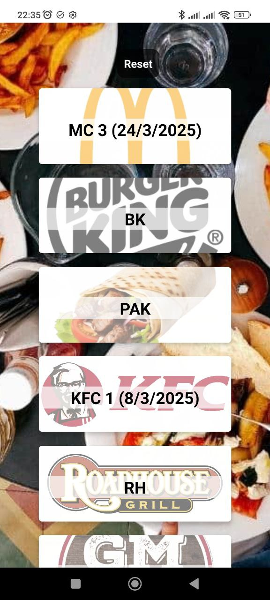

# EatOut App

This application helps users keep track of all the times they eat out at restaurants. Users can log all their meals, and the app shows how many times each restaurant has been visited, as well as the date of the last visit.
Users can also reset all the current data (e.g., to keep track of their monthly meals).

## Technologies Used

- React Native + Expo
- Async Storage for data persistance

## Screenshots

